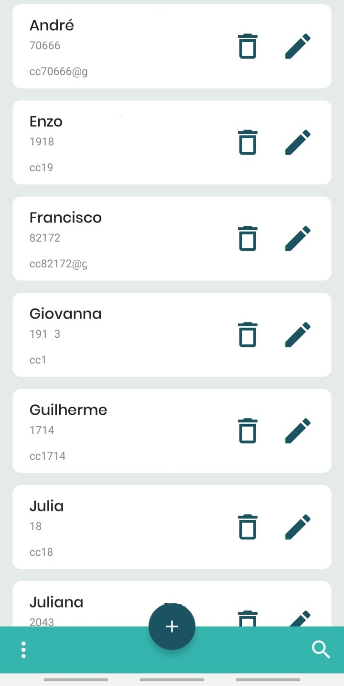

# CRUD-App-Android

Android and NodeJS project to add, update and delete students from a school. It consists of an API and an Android front-end. The API uses mssql driver, express and body-parser to receive requests and deal with the database. The android app uses the Material UI library, volley and retrofit.

<p float="left">
  
   
</p>

## Installation and Setup

Just download the project and run them separetely. To run the android app, you can either run the apk or open it in an IDE and run it there. To run the api, open it in a terminal and use:

```node
npm install
npm start
```

You will need a sql server database to use the api. To acces the data base, go to Node-API-Rest/src/config/db.example.config.js and change the file name to db.config.js. Then, change the content to your info:

```javascript
module.exports = {
    user: 'Database User',//Your user
    password: 'Password',// Your password
    server: 'Server', // Your server
    database: 'Database Name', // Your database name
    "options": {
      "encrypt": false,
      "enableArithAbort": true
      }
  };
```

## Meta

Project developed by [Eduardo Migueis](https://github.com/edumigueis) and [Rodrigo Smith](https://github.com/digo-smithh). Licensed under the [APACHE 2.0](https://choosealicense.com/licenses/apache-2.0/) license.